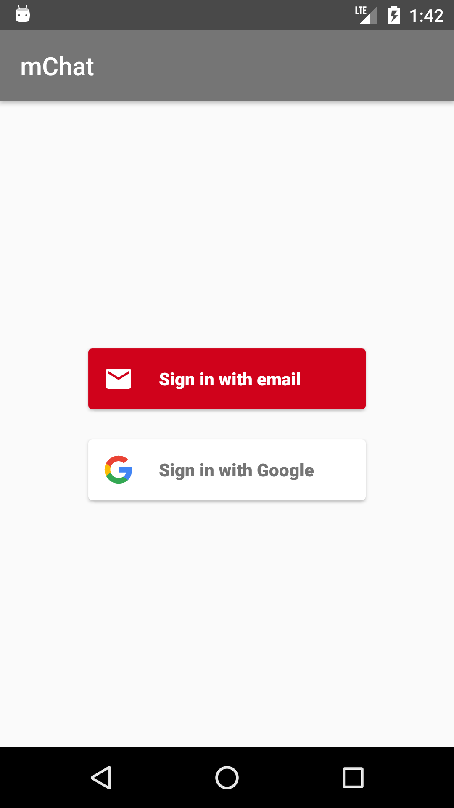

# mChatApp

mChat is a Android Chatbox App which is made completely by using firebase and JavaScript.

<div align="center">
	
</div>

---

## Feature used :

- **Firebase Features**
	- RealTime Database
	  ```
	  The Firebase Realtime Database is a cloud-hosted database. Data is stored as JSON and 
	  synchronized in realtime to every connected client. 
	  ```
	  > **mChat** uses **RealTime database** to store **Text messages** and **url** of Images Stored in firebase 
	  storage. 
	  
	- Storage
	  ```
	  Cloud Storage for Firebase is a powerful, simple, and cost-effective object storage 
	  service built for Google scale. The Firebase SDKs for Cloud Storage add Google security 
	  to file uploads and downloads for your Firebase apps, regardless of network quality. It 
	  can store images, audio, video, or other user-generated content. 
	  ```
	  >**mChat** uses **Firebase Storage** to store **Images**.
	  
	- Authentication
	  ```
	  Firebase Authentication provides backend services, easy-to-use SDKs, and ready-made UI 
	  libraries to authenticate users to your app. It supports authentication using passwords, 
	  phone numbers, popular federated identity providers like Google, Facebook and Twitter, 
	  and more. 
	  ```
	  >**mChat** uses **Firebase Authentication and Auth UI**  for **Email** and **Google Sign**.
	  
	- Firebase Cloud Messaging 
	  ```
	  Using FCM, you can notify a client app that new email or other data is available to sync. 
	  You can send notification messages to drive user re-engagement and retention. 
	  ```
	  >**mChat** uses **FCM** for sending **push notification** to all the users.
	  
	- Remote Config
	  ```
	  Firebase Remote Config is a cloud service that lets you change the behavior and appearance 
	  of your app without requiring users to download an app update. When using Remote Config, 
	  you create in-app default values that control the behavior and appearance of your app. 
	  ``` 
	  >**mChat** uses **Firebase Remote Config** to change the **text message length limit** remotely.
	  
	- Firebase Cloud Functions
	  ```
	  Cloud Functions for Firebase lets you automatically run backend code in response to events
	  triggered by Firebase features and HTTPS requests. Your code is stored in Google's cloud 
	  and runs in a managed environment.
	  ```
	  >**mChat** uses **Firebase Cloud Functions** to **deploy** a function Written in **JavaScript** to google clouds 		which **replace the certain words** in your message by a **Emoji** i.e. cake, cry, smile, good, bad , fire etc.
	  
---
## Snapshots :

<div align="center">
	
</div>

<div align="center">
	
</div>

<div align="center">
	
</div>

<div align="center">
	
</div>
